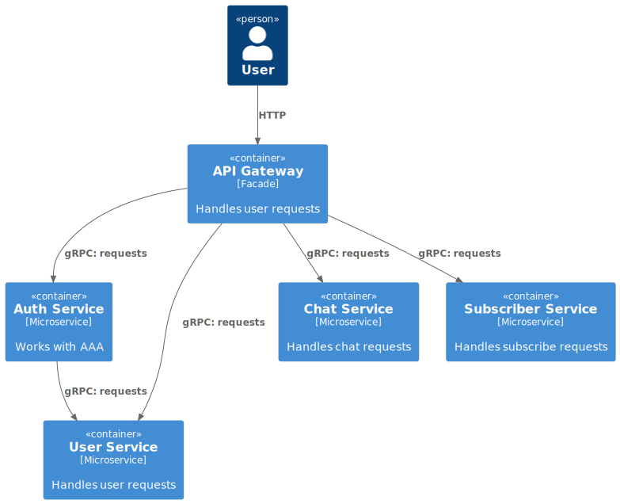

# mvp messenger
Course:
https://github.com/moguchev/microservices_like_in_bigtech_5

## Design overview

  

api_gateway (http/grpc):
    Фасад, взаимодействие с внешним миром.
    Хранит технические данные (кеш запросов, балансировка нагрузки, ограничение нагрузки) шлюза в in-memory хранилищах.

    Взаимодействует:
        с сервисом auth_service, для валидации запросов пользователя.
        с сервисом user_service для проксирования публичных методов сервиса.
        с сервисом chat_service для проксирования публичных методов сервиса.
        с сервисом subscriber_service для проксирования публичных методов сервиса.

    API:
        << все публичные методы сервисов >>

    С клиентами (web, desctop, mobile) во внешнем мире работает по http, 
    так как это более и распространенное API для различных устройств.
    Все внутреннее взаимодейтвие - через gRPC для скорости работы и поддержки контрактов. 
    
user_service (grpc):
    Сервис пользователей, отвечает за работу с объектом пользователь мессенджера.
    Содержит данные о пользователей.

    Взаимодействует:
        с сервисом auth_service для предоставления данных о пользователе.
        с сервисом api_gateway:
            для проксировании публичных запросов о пользователе.
            для кешировании запросов.
        с сервисом chat_service для предоставления данных о пользователе.
        с сервисом subscriber_service для предоставления данных о пользователе.

    API:
        Create
        Update: (никнейм - уникальный, информация о себе, аватарка)
        Read
        Search (никнейм)

    Все внутреннее взаимодейтвие - через gRPC для скорости работы и поддержки контрактов. 

auth_service (grpc):
    Сервис аутентификации и авторизации мессенджера (по почте с паролем и через Oauth).
    Отвечает за регистрацию, авторизацию и аутентификацию пользоватей.
    Содержит данные о правах пользователей, ролях пользователя.

    Взаимодействует:
        с сервисом api_gateway:
            для проверки пользователя.
            для предоставления данных о ролях пользователя.
            для кешировании запросов.
        с сервисом user_service для получения данных о пользователе.

    API:
        Register: (по почте и паролю + Oauth)
        Login: (по почте и паролю + Oauth)
        Logout
        Refresh_token

    Все внутреннее взаимодейтвие - через gRPC для скорости работы и поддержки контрактов. 

chat_service (grpc):
    Сервис чатов, отвечает за работу с чатами и сообщениями в чатах.
    Содержит данные о чатах и сообщениях.

    Взаимодействует:
        с сервисом api_gateway: 
            при проксировании запросов.
            для кешировании запросов.
        с сервисом user_service для получения данных о пользователе.
        с сервисом subscriber_service для получения данных о подписках.

    API:
        Create
        List
        SendMessage
        GetMessage

    Все внутреннее взаимодейтвие - через gRPC для скорости работы и поддержки контрактов. 

subscriber_service (grpc):
    Сервис подписок, отвечает за работу с подписками пользователей мессенджера.
    Содержит данные о подписках пользователей.

    Взимодействует:
        с сервисом api_gateway:
            при проксировании запросов.
            для кешировании запросов.
        с сервисом user_service для получения данных о пользователе.

    API:
        MakeFriend
        Unfriend
        Confirm
        Decline
        GetUserFriends (подтвердивших и неподтвердивших)
    
    Все внутреннее взаимодейтвие - через gRPC для скорости работы и поддержки контрактов. 

TODO:

#1
какие методы/API будет предоставлять, какие события публиковать/потреблять.

Нарисовать архитетуру (блок схему) backend приложения со связми сервисов (кто куда ходит и за чем).
Написать инструкцию или скрипт для того, чтобы можно было поднять все сервисы в контейнерах локально. (Подсказка: для удобства локальной разработки лучше всего воспользоваться docker-compose и Makefile)

⭐ Для каждого сервиса выбрать конкретную БД и обосновать, почему выбрана именно она. Если сервисы общаются асинхронно с помощью брокера сообщений, выбрать конкретный и обосновать.
⭐ Реализовать стратегии деплоя blue-green и canary с помощью стандартных средств kubernetes.

#2

Описать для каждого сервиса в Protobuf schema ваш API

Реализовать сервер обслуживающий API (REST/gRPC server). Обработка входящих запросов, валидация запросов (без бизнес логики) и отдача заглушки в виде ответа.

Добавить grpc-gateway и генерацию OpenAPI

⭐ Создать gRPC клиентов (интегрировать общение сервисов между собой)
⭐ Добавить linter и форматирование proto файлов
⭐ Прикрутить в сервисе с grpc-gateway SwaggerUI сервер, с помощью которого можно выполнять запросы на grpc-gateway proxy.